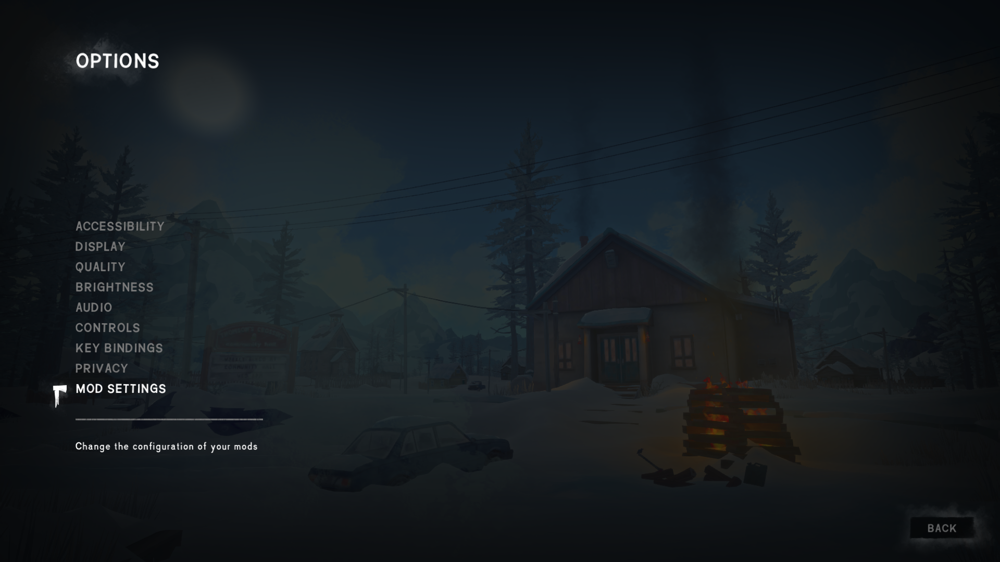
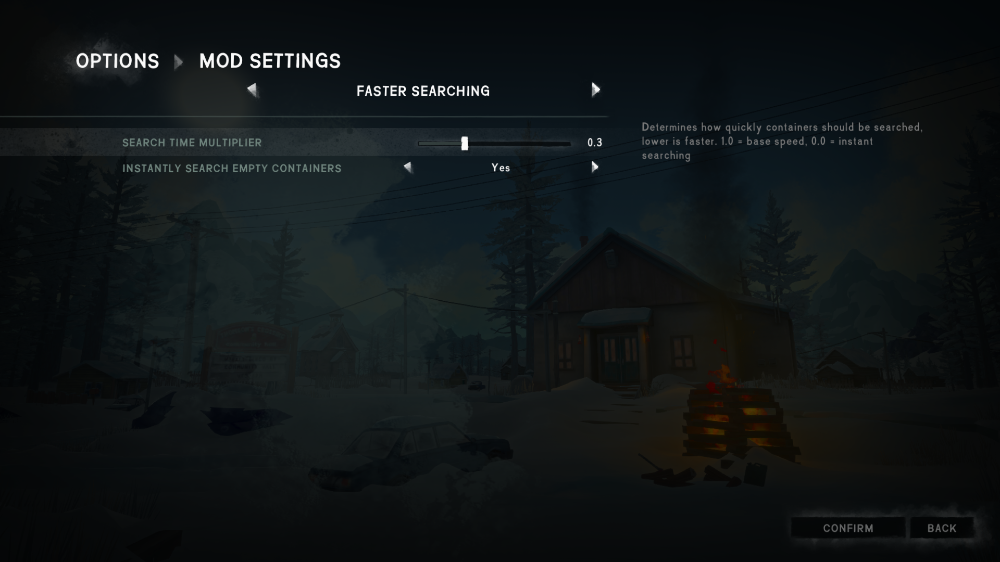

# FasterSearching

A mod for The Long Dark that speeds up the search action on containers and makes it instant for empty containers.

Configurable using [ModSettings](https://github.com/zeobviouslyfakeacc/ModSettings).

## Installation

1. If you haven't done so already, install MelonLoader by downloading and running [MelonLoader.Installer.exe](https://github.com/HerpDerpinstine/MelonLoader/releases/latest/download/MelonLoader.Installer.exe)
2. If you haven't done so already, install [ModSettings](https://github.com/zeobviouslyfakeacc/ModSettings) v1.6 or newer
3. Download the latest version of `FasterSearching.dll` from the [releases page](https://github.com/zeobviouslyfakeacc/FasterSearching/releases)
4. Move `FasterSearching.dll` into the Mods folder in your TLD install directory

Alternatively, you can download `FasterSearching_with_ModSettings.zip` and extract it into your Mods directory.

## Configuration

How long it takes to search containers and whether empty containers should be searched instantly can be changed in the mod settings:

1. In the main menu, select 'Options' and then 'Mod Settings'

   
2. Then, select 'Faster Searching' from the mod list

   
3. Make your changes to the settings
4. Finally, press the 'Confirm' button to save your changes
